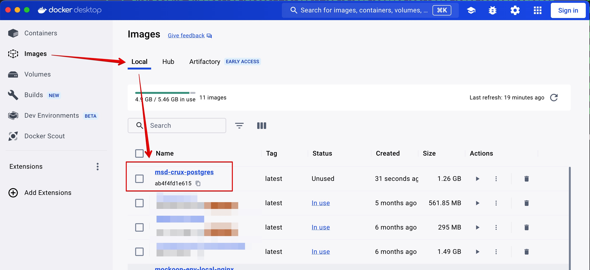
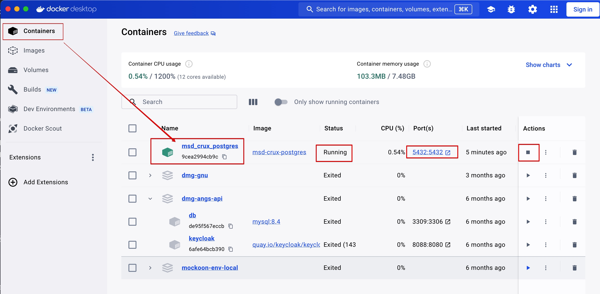

# 로컬 PC 개발환경에서 데이터베이스 사용
본 레포지토리에는 PostgreSQL을 실행할 수 있도록 도커파일이 준비되어있습니다.

개발 중 개인 PC에 포스트그레스를 별도 설치,설정할 필요 없이 로컬개발에 필요한 DB/스키마, 테이블을 생성하는 도커 컨테이너를 실행할 수 있습니다.

## □ prerequisites
로컬 PC에 도커가 설치, 실행되어 있어야 합니다. 

도커 이미지와 컨테이너 관리에대한 사항은 Docker Desktop 사용법 또는 [Docker 문서](https://docs.docker.com)를 참고하십시오.

## 🔑 DB 시크릿
아래 내용을 수행해서 준비되는 db의 비밀정보는 아래와 같습니다.

* 유저와 비밀번호: 
  * `root` / `vaporcloud`
  * `msd_db_user` / `vaporcloud1234`

* msd_db_user가 사용가능한 database 이름: `msd_db`

> ⚠️ 주의: 위 정보는 제공되는 로컬PC에서만 실행되어야할 도커이미지 전용입니다. 이 정보는 인터넷에 공개되어있습니다. 실제 서버의 DB에는 다른 도커이미지와 다른 시크릿을 사용하세요.

## □ 설치 및 도커데몬 실행 확인
터미널에서 `docker info`를 실행하면 설치여부를 확인 가능합니다.
~~~
$ docker info
~~~
정보가 출력되지 않는다면 설치 되지 않은 것이며, 출력되더라도 `Client`와 `Server` 항목 중에서 `Server`항목이 다음처럼 나온다면 Docker 데몬이 실행중이지 않은 것입니다:
~~~
Server:
ERROR: Cannot connect to the Docker daemon at unix:///Users/Violet/.docker/run/docker.sock. Is the docker daemon running?
~~~

도커가 설치되어있지 않다면 CLI 툴로 직접 설치하거나 [Docker Desktop](https://www.docker.com/products/docker-desktop/)를 설치 해주세요.

### Docker 데몬 실행
Docker Desktop 실행 또는 직접 설치 했다면:
~~~
$ sudo systemctl start docker
~~~

## □ Postgres 도커 이미지 빌드 및 컨테이너 실행

Postgres 도커파일은 본 레포지토리 root (git root)에서 `/docker/postgres` 디렉토리 하위에 있습니다.

터미널에서 먼저 현재위치가 레포지토리 root인지 확인하고 아니라면 이동합니다.
~~~
$ cd /git root 폴더경로/
~~~

### 1.  Docker 이미지 빌드
~~~
$ docker build -t msd-crux-postgres ./docker/postgres/
~~~
* ./docker/postgres/: Git 루트기준에서 docker/postgres 폴더의 `Dockerfile`로 이미지 빌드
* -t msd-crux-postgres: 이미지 이름 설정

빌드하고나면 Docker Desktop의 Images 탭에서 `msd-crux-postgres`이름으로된 이미지를 찾을 수 있습니다.

또는 다음 명령어를 사용해서 Docker가 보유중인 이미지에서 `msd-crux-postgres`를 찾을 수 있습니다:
~~~
$ docker images
~~~

### 2. Docker 컨테이너 실행
~~~
$ docker run -d --name msd_crux_postgres -p 5432:5432 msd-crux-postgres
~~~
* --name msd_crux_postgres: 컨테이너 이름 지정.
* -p 5432:5432: 로컬 포트와 컨테이너의 PostgreSQL 포트를 연결.
* msd-crux-postgres: 빌드한 Docker 이미지 이름.

성공적으로 컨테이너가 실행되면 Docker Desktop에 `Runnig`과 실행중인 포트번호를 볼 수 있습니다:

또는 다음 명령어로 확인할 수 있습니다.
~~~
$ docker ps
~~~
그러면 실행중인 컨테이너 항목 중 `msd-crux-postgres`가 나오게 됩니다:
~~~
CONTAINER ID   IMAGE               COMMAND                  CREATED              STATUS              PORTS                    NAMES
9cea2994cb9c   msd-crux-postgres   "docker-entrypoint.s…"   About a minute ago   Up About a minute   0.0.0.0:5432->5432/tcp   msd_crux_postgres
~~~

## □ PostgreSQL 접속
다음 방법 중 하나를 통해서 접속할 수 있습니다.
- A) 컨테이너 외부에서 직접접속:
  - `psql` 명령어 사용
    - 로컬 PC에 `psql` 명령어가 설치되어 있어야 합니다.
  - [PostgreSQL GUI 클라이언트 프로그램](https://www.pgadmin.org) 사용
- B) 실행중인 컨테이너 내부에 접속:
  -`psql` 명령어 사용
    - 컨테이너 내부에는 이미 `psql`이 포함되어있습니다.

B) 방법으로 컨테이너 내부에 접속하려면 컨테이너 이름과 함께 다음 명령어를 사용:
~~~
$ docker exec -it msd_crux_postgres bash
~~~

컨테이너 내부에 접속되면 터미널이 다음같은 `:/#` 으로 끝나는 명령줄로 바뀝니다:
> 4e4b0d9fcb8f:/#

 이후 `psql` 문 사용은 A), B) 방법 동일합니다.

## □ psql 사용

### 1) root로 `msd_db` 데이터베이스에 접속:
~~~
# psql -U root -d msd_db
~~~
 컨테이너 내부가 아닌 외부접속시에는 root 비밀번호가 필요합니다. 
> root 비밀번호: `vaporcloud`

터미널 명령줄 시작부가 `msd_db=#`로 바뀌면 정상적으로 PostgreSQL의 `msd_db` 데이터베이스에 접속 된 것입니다.

접속이 되고나면 SQL 문과 PostgreSQL CLI 명령어 셋을 사용할 수 있습니다.

### 2) 포스트그레스 CLI 명령어 셋

* `\l` : 데이터베이스 목록 보기
* `\du` : DB User 목록 보기
* `\dt` : 테이블 목록 보기
* `SELECT * FROM timescaledb_information.hypertables;` : 하이퍼테이블 목록보기
* `\d {스키마}.{테이블이름}` : 해당 스키마(기본은 public)의 테이블 이름
* `\d {테이블이름}` : public 스키마의 특정 테이블 구조
* `exit` : 접속 종료

#### DB 유저 확인

> \du

`\du` 명령어로 `msd_db_user`가 확인되어야 합니다.

#### 테이블 확인

> \dt

`\dt` 명령어로 여러 테이블이 확인되어야 합니다.

#### 테이블 구조 확인
> \d public.user

테이블 구조는 `\d {public스키마}.{테이블명}` 형식 명령어를 입력해서 확인할 수 있습니다.

~~~
                                        Table "public.user"
     Column      |          Type          | Collation | Nullable |             Default              
-----------------+------------------------+-----------+----------+----------------------------------
 id              | integer                |           | not null | nextval('user_id_seq'::regclass)
 login_id        | character varying(30)  |           | not null | 
 login_pw        | character varying(128) |           | not null | 
 salt            | character(22)          |           | not null | 
 name            | character varying(100) |           | not null | 
 employee_number | character(10)          |           |          | 
 roles           | character varying(100) |           |          | 
 profile_img     | text                   |           |          | 
 profile_text    | text                   |           |          | 
Indexes:
    "user_pkey" PRIMARY KEY, btree (id)
    "user_login_id_key" UNIQUE CONSTRAINT, btree (login_id)
~~~

#### 하이퍼 테이블 (시계열 테이블) 구조 확인

> SELECT * FROM timescaledb_information.hypertables;

~~~
 hypertable_schema | hypertable_name | owner | num_dimensions | num_chunks | compression_enabled | tablespaces 
-------------------+-----------------+-------+----------------+------------+---------------------+-------------
 public            | injection_cum   | root  |              2 |          0 | f                   | 
 public            | vision_cum      | root  |              2 |          0 | f                   | 
(2 rows)

~~~

### 접속 종료 명령어
> exit;
두번 입력하면 컨테이너를 빠져나갑니다.
